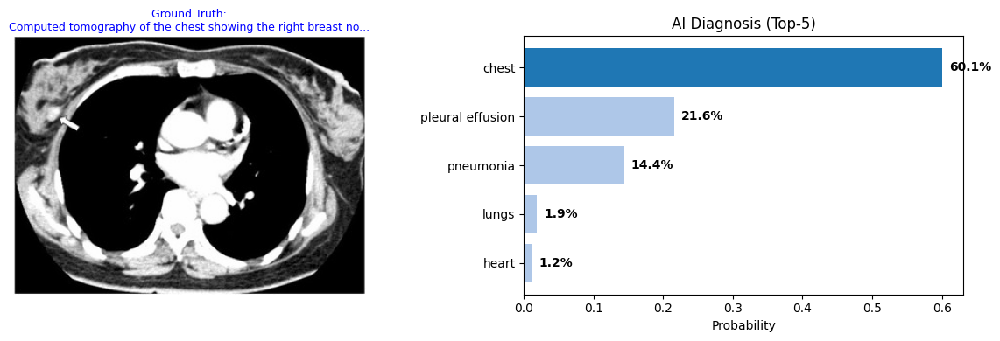
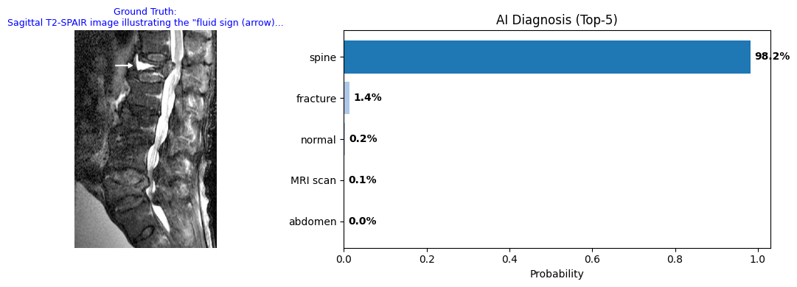
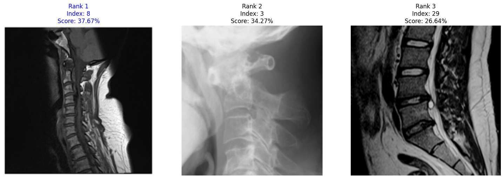

# MedCLIP-LoRA: CLIP for Medical Image with fine tuning

## Project Overview (项目简介)

This project implements a parameter-efficient fine-tuning (PEFT) approach to adapt the **CLIP (Contrastive Language-Image Pre-training)** model for the medical domain. By utilizing **LoRA (Low-Rank Adaptation)**, we successfully aligned general-domain visual-text representations with radiology concepts (X-ray, CT, MRI, Ultrasound) using the **ROCO dataset**, achieving high-performance Zero-Shot Classification and Image-Text Retrieval with minimal computational resources.

本项目实现了基于 LoRA 的 CLIP 模型微调，旨在将通用多模态模型适配于医学影像领域。通过在 ROCO 数据集上的训练，模型实现了精准的**医学零样本分类**和**以文搜图**功能。

## How to view the code?
Because there are some errors happened in the rendering of Github, so please just download the "CLIP(LoRA)medical.ipynb"

## Key Features

* **Efficient Training:** Fine-tuned <1% of parameters using LoRA, reducing Training Loss from **2.2 to 0.3**.
* **Zero-Shot Diagnosis:** Capable of classifying unseen medical images into pathologies (e.g., Pneumonia vs. Normal) or anatomical parts (e.g., Head vs. Spine) without re-training.
* **Semantic Image Retrieval:** Retrieves relevant medical images from a database using natural language queries (e.g., "Lateral view of the lumbar spine").

## Methodology & Tech Stack

* **Base Model:** `openai/clip-vit-base-patch32`
* **Dataset:** [ROCOv2 (Radiology Objects in COntext)](https://huggingface.co/datasets/eltorio/ROCOv2-radiology)
* **Techniques:** * **Contrastive Learning (InfoNCE Loss)**
  * **LoRA (Low-Rank Adaptation)** applied to `q_proj` and `v_proj`
* **Infrastructure:** Google Colab (T4 GPU)

## Results & Demo 

### 1. Training Convergence

The model showed rapid convergence. The contrastive loss dropped significantly, indicating strong alignment between medical images and text captions.

### 2. Quantitative Evaluation (Recall@K)

We evaluated the retrieval performance on a held-out subset. The model achieved competitive recall rates, significantly outperforming random baselines.

### 3. Zero-Shot Medical Diagnosis

The model demonstrates "semantic reasoning." In the case below (Head CT), when the explicit label was provided, it hit **100% confidence**. Even without the exact label, it correctly associated the skull features with "Broken Bone" (96%) rather than unrelated organs like Lungs.

### 4. Text to Image Retrieval

Query: *"Spine"*
Result: The model successfully retrieved X-ray and MRI scans of the spine from the database, ranking them as the Top-3 matches.

### 5. Stress Test (Random Sampling)

Evaluated on random samples with 20+ mixed candidate labels (Modality + Anatomy + Pathology). The model consistently ranked the Ground Truth label within the Top-5 predictions despite heavy distractions.

